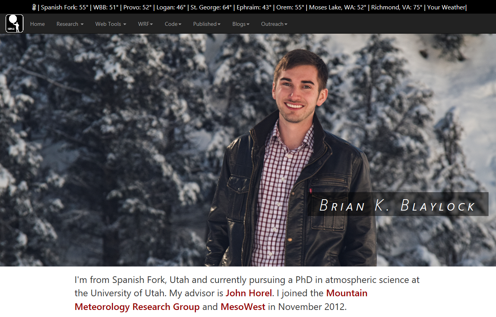

## Brian Blaylock Homepage

Code that builds my research homepage. Enjoy!  
http://home.chpc.utah.edu/~u0553130/Brian_Blaylock/home.html

#### Menu options:
- Home: redirect to home page.
- Research: Details about active and past research.
- Web Tools: Various web tools for viewing data, etc.
- WRF: Info on things I've done with WRF.
- Code: Links to github code.
- Published: Links to published works, written and oral. 
- Blogs: Blogs I write or follow.
- Outreach: Outreach material for things I do.